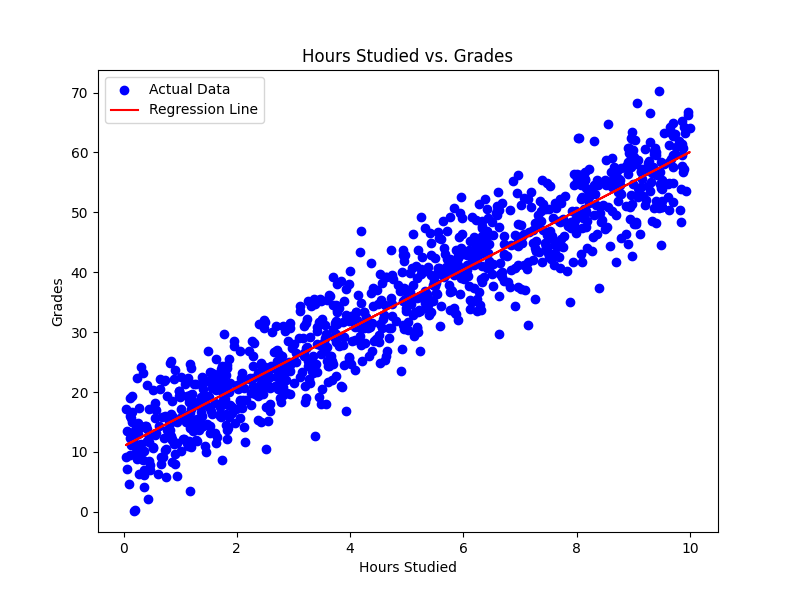

# Students Grade Prediction Model

This repository contains a machine learning model that predicts student grades based on the number of hours they studied. The model uses a simple linear regression technique to establish a relationship between the number of hours studied and the resulting grades.I have used scikit-learn to train this model.

## Table of Contents

- [Installation](#installation)
- [Model Explanation](#model-explanation)
- [Visualization](#visualization)
- [Predicting New Data](#predicting-new-data)

## Installation

### Prerequisites

- Python 3.6 or above
- Pip (Python package manager)

### Required Python Packages

Make sure you have the following Python packages installed:

- `numpy`
- `pandas`
- `matplotlib`
- `scikit-learn`

You can install the required packages using the following command:

```bash
pip install numpy pandas matplotlib scikit-learn
```
## Model Explanation
The model is built using a linear regression algorithm provided by the scikit-learn library. It takes the number of hours studied as the input (independent variable) and predicts the corresponding grade (dependent variable).
Steps in the Script:
Load Data: The script reads the CSV file containing the dataset.
Prepare Features and Target: The dataset is split into features (Hours_Studied) and target (Grades).
Split the Data: The data is split into training and testing sets.
Train the Model: A linear regression model is trained on the training data.
Make Predictions: The trained model makes predictions on the test data.
Evaluate the Model: The model's performance is evaluated using metrics such as Mean Absolute Error (MAE), Mean Squared Error (MSE), and R-squared (R²).


## Visualization
The script generates a scatter plot showing the correlation between the hours studied and the grades. The regression line is also plotted, showing the linear relationship established by the model.

## To visualize the data:
```python
plt.figure(figsize=(8, 6))
plt.scatter(X, y, color='blue', label='Actual Data')
plt.plot(X, model.predict(X), color='red', label='Regression Line')
plt.title('Hours Studied vs. Grades')
plt.xlabel('Hours Studied')
plt.ylabel('Grades')
plt.legend()
plt.show()
```



## Predicting New Data
You can easily predict grades for new data points by modifying the new_hours variable in the script:
```python
new_hours = np.array([[9]])  # Example: Predicting for 9 hours studied
predicted_score = model.predict(new_hours)
print(f"Predicted Grade for 9 hours of study: {predicted_score[0]}")


